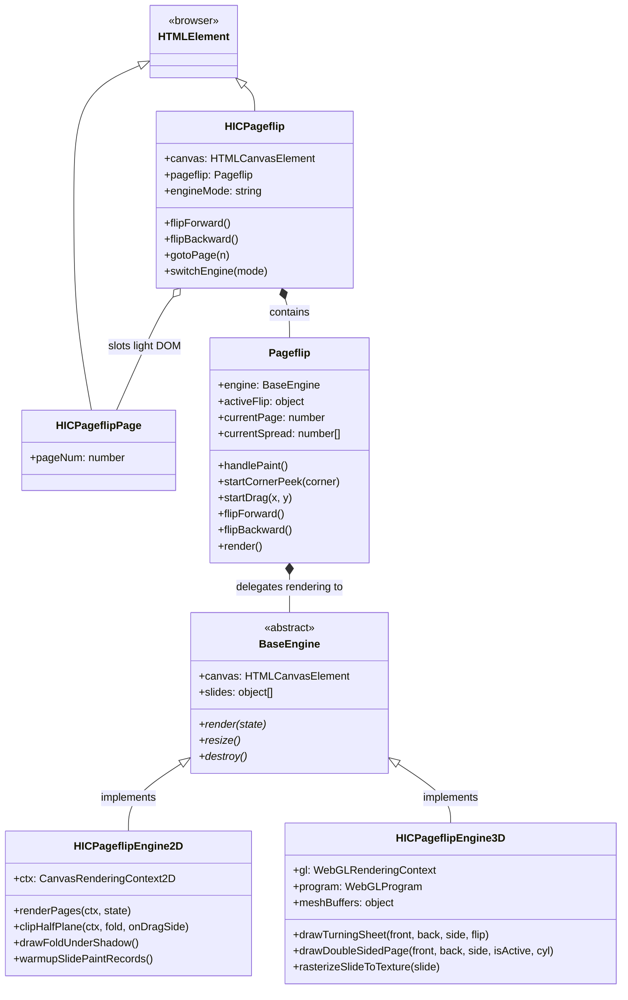

# `<hic-pageflip>`

An interactive page flip book viewer powered by the [**HTML-in-Canvas** web API](https://developer.chrome.com/blog/html-in-canvas-origin-trial).

[](https://hic-pageflip.netlify.app/)

> [!WARNING]
> **HTML-in-Canvas is experimental technology.**
> This project relies on experimental browser APIs (`<canvas layoutsubtree>`, `ctx.drawElementImage`, `gl.texElementImage2D`, and `canvas.updateElementGeometry`) currently being developed in Chromium. Features and API surfaces are subject to change.

---

## Overview

`<hic-pageflip>` allows you to render interactive, flip-book style page presentations where every page is composed of **real, accessible DOM elements** (with selectable text, live links, CSS animations, and rich markup), while being deformed and rendered through high-performance 2D Canvas or 3D WebGL deformation pipelines.

[Try a live demo](https://hic-pageflip.netlify.app/)

---

## Prerequisites

To view and interact with `<hic-pageflip>`, you need a browser that supports the **HTML-in-Canvas** API (e.g. Chrome):

1. **Browser**: Google Chrome (v149+ recommended).
2. **Flag**: Enable `chrome://flags/#canvas-draw-element`

---

## Installation & Usage

### Installation

```bash
npm install hic-pageflip
```

### Usage

After installation, import the **main entry point** once in your application.

```js
import 'hic-pageflip';
```

The package will auto-register the `<hic-pageflip>` and `<hic-pageflip-page>` web components for you. No need to do anything else!

---

## Example

```html
<script type="module" src="./js/hic-pageflip/index.js"></script>

<hic-pageflip engine="3d" page-width="1024" page-height="768" page-background="#ffffff">
  <!-- Slide 1: Cover -->
  <hic-pageflip-page>
    <div class="content">
      <h1>Cover Page</h1>
      <p>This is live HTML inside a 3D WebGL pageflip!</p>
    </div>
  </hic-pageflip-page>

  <!-- Slide 2 -->
  <hic-pageflip-page>
    <div class="content">
      <h2>Inside Left Page</h2>
      <p>Selectable text and clickable <a href="#test">links</a> work natively.</p>
    </div>
  </hic-pageflip-page>

  <!-- Slide 3 -->
  <hic-pageflip-page>
    <div class="content">
      <h2>Inside Right Page</h2>
    </div>
  </hic-pageflip-page>

  <!-- Slide 4: Backcover -->
  <hic-pageflip-page>
    <div class="content">
      <h2>Backcover</h2>
      <p>This is the backcover page.</p>
    </div>
  </hic-pageflip-page>
</hic-pageflip>
```

To prevent a FOUC while the custom elements are not defined, add the following CSS:

```css
/* Prevent Flash of Undefined Custom Elements (FOUC) */
hic-pageflip:not(:defined),
hic-pageflip-page:not(:defined) {
  display: none !important;
}

/* Fade-in hic-pageflip once defined */
hic-pageflip:defined {
  transition: opacity 0.35s ease-out;
  @starting-style {
    opacity: 0;
  }
}
```

Also, don’t forget to size your `<hic-pageflip>` element, otherwise it will collapse to `0x0`.

```css
hic-pageflip:defined {
  display: block;
  width: 100%;
  max-width: 1024px;
  aspect-ratio: 1024 / 768;
}
```

---

## Custom Element Reference

### `<hic-pageflip>` Attributes & Properties

| Attribute | Property | Type | Default | Description |
| :--- | :--- | :--- | :--- | :--- |
| `engine` | `engine` / `engineMode` | `string` | `'2d'` | Rendering engine mode: `'2d'` or `'3d'`. |
| `page-width` | `pageWidth` | `number` | `1024` | Width of a single page in CSS pixels. |
| `page-height` | `pageHeight` | `number` | `768` | Height of a single page in CSS pixels. |
| `page-background` | `pageBackground` | `string` | `'white'` | Background color/fill applied to each page sheet. |
| `page` | `page` / `currentPage` | `number` | `0` | Current page index (0 = Cover / Spread [0, 1]). |

### Methods

```javascript
const pageflip = document.querySelector('hic-pageflip');

// Navigate forwards by one spread
pageflip.flipForward();

// Navigate backwards by one spread
pageflip.flipBackward();

// Jump to a specific page number
pageflip.gotoPage(4);

// Switch rendering engine
pageflip.engine = '3d'; // or '2d'

// Reload textures from DOM
pageflip.reloadTextures();
```

### Events

- **`pagechange`**: Fired when the active spread changes upon completing a flip.
  ```javascript
  pageflip.addEventListener('pagechange', (e) => {
    console.log('Current page:', e.detail.currentPage);
    console.log('Current spread:', e.detail.currentSpread); // e.g. [2, 3]
  });
  ```
- **`flipprogress`**: Fired continuously during drag or transition animation ticks with progress data.

---

## Rendering Engines

`<hic-pageflip>` comes equipped with two distinct rendering engines that can be switched dynamically at runtime via the `engine` attribute or property:

### 1. 2D Engine (`engine="2d"`)
- **Class**: [`HICPageflipEngine2D`](src/js/hic-pageflip/core/engines/engine-2d.js)
- **Technology**: 2D Canvas context with direct DOM element drawing via `ctx.drawElementImage()`.
- **Techniques**:
  - **Geometric Fold Clipping**: Uses half-plane clipping (`clipHalfPlane`) to separate the stationary spread, underneath revealed pages, and turning flap.
  - **Affine Reflection**: Performs 2D affine matrix reflection across the dynamic fold crease line.
  - **Dynamic Lighting**: Renders drop shadows cast under the fold crease and spine gutter shadows.
  - **Pre-warmed Paint Records**: Pre-warms slide paint records to eliminate unstyled content flashing during initial corner peeks.

### 2. 3D Engine (`engine="3d"`)
- **Class**: [`HICPageflipEngine3D`](src/js/hic-pageflip/core/engines/engine-3d.js)
- **Technology**: WebGL / WebGL2 context capturing live DOM nodes to GPU textures via `gl.texElementImage2D()`.
- **Techniques**:
  - **Chris Luke's Page Curl Algorithm**: Complete GLSL vertex shader implementation based on [*The Anatomy of a Page Curl*](https://blog.flirble.org/2010/10/08/the-anatomy-of-a-page-curl/).
  - **Cylindrical & Conical Deformation**: Dynamically transitions between a uniform cylinder (for horizontal flips) and a tapered cone (for diagonal corner pulls), keeping the fold apex anchored to the page edge without bulging.
  - **Hardware Dual-Sided Texturing**: Shaders sample front (`uSamplerFront`) and back (`uSamplerBack`) textures in a single draw pass using `gl_FrontFacing`.
  - **Z-Fighting Prevention**: Employs sub-pixel depth offsetting (`uDepthOffset`) to eliminate z-fighting between overlapping sheets.

---

## Package Folder Structure

```
hic-pageflip
├── package.json
├── README.md
├── index.js                  # Main entry point exporting Custom Elements
├── components/
│   ├── hic-pageflip.js       # <hic-pageflip> Web Component
│   └── hic-pageflip-page.js  # <hic-pageflip-page> Web Component
└── core/
    ├── pageflip.js           # Core Pageflip state machine & gestures
    ├── engines/
    │   ├── engine-base.js    # BaseEngine abstract base class
    │   ├── engine-2d.js      # HICPageflipEngine2D (2D Canvas)
    │   └── engine-3d.js      # HICPageflipEngine3D (3D WebGL)
    └── utils/
        └── math.js           # Fold math, easing curves, constraints
```

---

## Class Inheritance & Architecture Structure



### Architectural Highlights

1. **Shadow DOM & Layout Subtree**:
   `<hic-pageflip>` encapsulates the rendering canvas in its Shadow Root using `<canvas layoutsubtree><slot></slot></canvas>`. This projects light-DOM `<hic-pageflip-page>` elements directly into the browser's canvas layout subtree without manual DOM relocation.
2. **Engine Decoupling**:
   `Pageflip` acts as an engine-agnostic controller managing gesture coordinates, timeline animations, paper constraint math (`constrainPaper`), and page state. It delegates painting to whichever `BaseEngine` implementation is currently active.
3. **Pluggable Engine Hierarchy**:
   Both `HICPageflipEngine2D` and `HICPageflipEngine3D` extend `BaseEngine` and implement a unified interface (`render`, `resize`, `setDimensions`, `destroy`), allowing seamless hot-switching between 2D and 3D rendering modes on the fly.

---

## Development

### Run Locally

```bash
# Start local development server on port 3000
npm start
```

Point your browser at `http://localhost:3000` to see.

### Deploy the demo to Netlify

```bash
npm run deploy
```

### Publish the package

Do not run `npm publish` but, instead, run a custom publish script:

```bash
npm run pub
```

The script will automatically build the project first into the `dist` folder, and only publish the contents of that folder.

---

## References

- [The Anatomy of a Page Curl by Chris Luke](https://blog.flirble.org/2010/10/08/the-anatomy-of-a-page-curl/)
- [Chrome HTML-in-Canvas Documentation](https://developer.chrome.com/blog/html-in-canvas-origin-trial)

---

## License

[MIT](LICENSE) © [Bramus Van Damme](https://www.bram.us)
